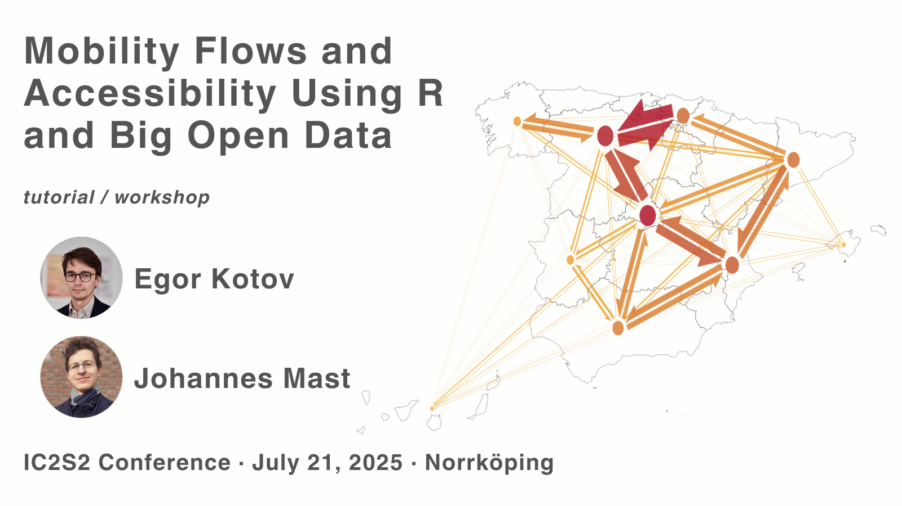

This repository is part of the workshop and tutorial "Mobility Flows and Accessibility Using R and Big Open Data" workshop at IC2S2 2025 conference [https://www.ic2s2-2025.org/](https://www.ic2s2-2025.org/) in Norrköping.

## Run this repository in RStudio with just your web browser using Binder. Push the button >> 

The website with the workshop materials and slides is available at: [https://www.ekotov.pro/spanish-open-mobility-workshop-ic2s2-2025/](https://www.ekotov.pro/spanish-open-mobility-workshop-ic2s2-2025/)
